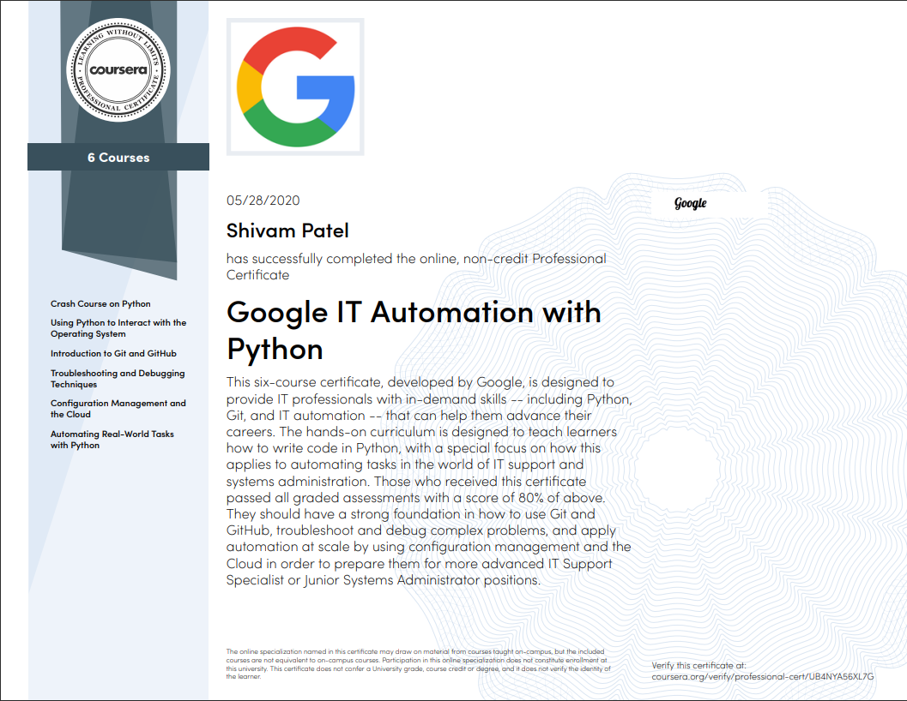

Google IT Automation With Python
================================

This repository is created to keep track of Google IT Automation With Python provided by Coursera. 

This beginner-level, six-course certificate, developed by Google, is designed to provide IT professionals with in-demand skills -- including Python, Git, and IT automation.

Table of Contents
------------------

- [Crash Course On Python](https://github.com/shivampatel22/google-it-automation-with-python-specialization/tree/main/C1-Crash-Course-On-Python/Wordcloud)
- [Using Python to Interact with the Operating System](https://github.com/shivampatel22/google-it-automation-with-python-specialization/tree/main/C2-Interacting-with-OS-using-python)
- [Introduction to Git and GitHub](https://github.com/shivampatel22/google-it-automation-with-python-specialization/tree/main/C3-Introduction-to-git-and-github)
- [Troubleshooting and Debugging Techniques](https://github.com/shivampatel22/google-it-automation-with-python-specialization/tree/main/C4-Troubleshooting-and-debugging-techniques)
- [Configuration Management and the Cloud](https://github.com/shivampatel22/google-it-automation-with-python-specialization/tree/main/C5-Configuration-management-and-the-cloud)
- [Automating Real-World Tasks with Python](https://github.com/shivampatel22/google-it-automation-with-python-specialization/tree/main/C6-Automating-real-world-tasks-with-python)

Credits
=======

Coursera - [Google IT Automation with Python Professional Certificate](https://www.coursera.org/professional-certificates/google-it-automation)
